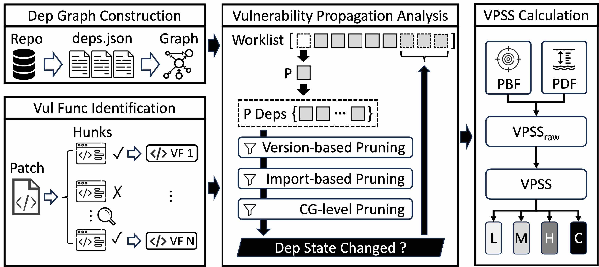

<p align="center">
  
</p>

## 🏹 Introduction (Under Construction)

The primary motivation of this project is derived from the [CVSS 4.0 FAQ](https://www.first.org/cvss/v4.0/faq):

> Is there a prescribed way to use CVSS Base and Environmental metrics to score a vulnerability along a long supply chain?  
> 
> Answer - No.


## 🏗️ Environment Initialization

Please prepare a clean workspace and execute the following commands:

```bash
# within the workspace
git clone https://github.com/brant-ruan/vpss.git
mkdir workdir
```

Then, install the required Python packages:

```bash
# within the workspace
cd vpss
# It is recommended to create a virtual environment first
virtualenv -p /usr/bin/python3 venv
source venv/bin/activate
pip install -r requirements.txt
```

Besides, ensure `unzip`, `jar`, and `jdeps` commands are available in your PATH.

We also need to install Java and Maven for this project. Please ensure that `java` and `mvn` commands are available in your PATH. The version of Java and Maven in our experiments are shown below:

<details>
<summary>Environment Details</summary>

```bash
java -version
# openjdk version "17.0.14" 2025-01-21
# OpenJDK Runtime Environment (build 17.0.14+7-Ubuntu-124.04)
# OpenJDK 64-Bit Server VM (build 17.0.14+7-Ubuntu-124.04, mixed mode, sharing)

mvn -v
# Apache Maven 3.8.7
# Maven home: /usr/share/maven
# Java version: 17.0.14, vendor: Ubuntu, runtime: /usr/lib/jvm/java-17-openjdk-amd64
# Default locale: en_US, platform encoding: UTF-8
# OS name: "linux", version: "6.8.0-56-generic", arch: "amd64", family: "unix"
```
</details>

## 🛠️ Workflow

### 🖼️ Overview

The workflow of VPSS is shown as below:



Please refer to [the paper](https://arxiv.org/pdf/2506.01342) for more details.

Note that some steps in the workflow may take a very long time to finish. We recommend using tools like `tmux` or `screen` to avoid unexpected interruptions.

### 🗺️ Step 1: Dependency Graph Construction

#### Step 1.1: MCR Index Preparation

For the first time, we need to download the latest [Maven Central Repository (MCR) index](https://repo1.maven.org/maven2/.index/) data:

```bash
# within the workspace
mkdir -p workdir/mcr && cd workdir/mcr
wget https://repo1.maven.org/maven2/.index/nexus-maven-repository-index.gz
java -jar indexer-cli-5.1.1.jar --unpack nexus-maven-repository-index.gz --destination central-lucene-index --type full
```

After that, we will have a `central-lucene-index` folder under `workdir/mcr/`, which contains the MCR index data.

#### Step 1.2: Artifact List Extraction

Now, run the `maven-index-parser` to extract the artifact list from the MCR index:

```bash
# within the workspace
cd vpss/package-analysis/maven-index-parser
# build the project
mvn -Dmaven.compiler.source=17 -Dmaven.compiler.target=17 clean package
# run the parser
mvn exec:java -Dexec.mainClass="com.vpa.App"
```

After that, we will get an `artifact-list.csv` file under `workdir/mcr/` with the following format:

<details>
<summary>Example of artifact-list.csv</summary>

```csv
GroupId,ArtifactId,Version,Timestamp
org.sonatype.nexus.plugins.ldap,nexus-ldap-plugin-it,1.9.2.1,1310694579000
org.ow2.util,util-plan-monitor-api,1.0.16,1239010118000
org.ow2.util,util-geolocation-ear,1.0.28,1299604696000
org.seleniumhq.selenium,selenium-ie-driver,2.4.0,1313612545000
org.ow2.jonas.assemblies,binaries,5.2.0-M4,1297362732000
...
```

</details>

Then, convert the CSV file into JSON format for later use:

```bash
# within the workspace
cd vpss/package-analysis
python scripts/gav_csv_to_json.py ../../workdir/mcr/artifacts-list.csv ../../workdir/mcr/artifacts-list.json
```

#### Step 1.3: POM File Downloading

Now, we can download the `pom.xml` files for all artifacts in MCR by running the following commands:

```bash
# within the workspace
cd vpss/package-analysis
python scripts/download_poms.py ../../workdir/mcr/artifacts-list.json
```

Note that this step may take a **very very long time** if only one thread is used. Hence, the command above is only for demonstration purposes. In practice, you need to split the `artifacts-list.json` file into multiple smaller files and run multiple instances of `download_poms.py` in parallel to speed up the download process.

#### Step 1.4: POM File Parsing

Now, we can parse all downloaded `pom.xml` files to generate the dependency JSON files by running the following commands:

```bash
# within the workspace
cd vpss/package-analysis/maven-dep-parser
# build the project
mvn -Dmaven.compiler.source=17 -Dmaven.compiler.target=17 clean package
# run the parser
mvn exec:java -Dexec.mainClass="com.vpa.EffectivePomGenerator"
```

After that, we will get a `deps/` folder under `workdir/kb/`, which contains the dependency JSON files. The path of each file follows the format: `workdir/kb/deps/{groupId}/{artifactId}/{version}/dependencies.json`.

An example JSON file (`workdir/kb/deps/com.agifac.maf.packaging/maf-desktop/15.0.0/dependencies.json`) is shown below:

<details>
<summary>Example of dependencies.json</summary>

```json
{
  "com.agifac.maf.packaging:maf-desktop:15.0.0": [
    "com.agifac.maf.desktop:maf-desktop-app:15.0.0",
    "com.agifac.lib:maf-defaultplugins-extension:15.0.0"
  ]
}
```

</details>

#### Step 1.5: Dependency Graph Generation

Now, we can generate the dependency graph by running the following commands:

```bash
# within the workspace
cd vpss/package-analysis
python scripts/build_dependency_graph.py
```

After that, we will get a `ga_dependency_graph.graphml` file under `workdir/`, which contains the GA-level dependency graph of MCR artifacts.

#### Step 1.6: Storage of Dependency Graph

To ensure efficient access to the dependency graph in later steps, we spawn a Neo4j database container and import the dependency graph into it. We provide the necessary commands for this process below, while you may need to adjust certain parameters based on your specific environment.

<details>
<summary>Neo4j Container Setup and Graph Import</summary>

```bash
# within the workspace (assume $WORKSPACE is the absolute path of the workspace)
mkdir -p $WORKSPACE/neo4j/data
mkdir -p $WORKSPACE/neo4j/logs
mkdir -p $WORKSPACE/neo4j/conf
mkdir -p $WORKSPACE/neo4j/import
mkdir -p $WORKSPACE/neo4j/plugins

PASSWORD="your_password_here"  # please change this to a secure password
# Also, remember to specify the same password value for the NEO4J_PASSWORD variable in core/config.py

sudo docker run -d \
    --name neo4j_vpa \
    -p 7477:7474 -p 7689:7687 \
    -e NEO4J_AUTH=neo4j/$PASSWORD \
    -v $WORKSPACE/neo4j/data:/data \
    -v $WORKSPACE/neo4j/logs:/logs \
    -v $WORKSPACE/neo4j/conf:/conf \
    -v $WORKSPACE/neo4j/import:/var/lib/neo4j/import \
    -v $WORKSPACE/neo4j/plugins:/plugins \
    -e NEO4J_apoc_export_file_enabled=true \
    -e NEO4J_apoc_import_file_enabled=true \
    -e NEO4J_apoc_import_file_use__neo4j__config=true \
    -e NEO4J_PLUGINS=\[\"apoc\"\] \
    neo4j:latest

# import the networkx-based graph with the APOC plugin
sudo cp workdir/ga_dependency_graph.graphml $WORKSPACE/neo4j/import
sudo docker exec -it neo4j_vpa cypher-shell -u neo4j -p $PASSWORD
# then run the following command within the cypher-shell
# neo4j@neo4j> CALL apoc.import.graphml("import/ga_dependency_graph.graphml", {readLabels: true});
```

</details>

Now the dependency graph is stored in the Neo4j database for later use.

#### Notes on Incremental Updates

There is no need to build the dependency graph from scratch every time. Instead, you can perform incremental updates by only downloading and parsing the newly added or updated artifacts since the last update.

For the update of the MCR index, you can refer to the following materials and program via the [Maven Indexer API](https://maven.apache.org/maven-indexer/indexer-core/apidocs/):

- [Maven Indexer Documentation](https://maven.apache.org/repository/central-index.html)
- [Nexus Indexer 2.0: Incremental downloading](https://www.sonatype.com/blog/2009/05/nexus-indexer-20-incremental-downloading)
- [indexer-example-basic](https://maven.apache.org/maven-indexer-archives/maven-indexer-7.1.6/maven-indexer-examples/indexer-examples-basic/xref/org/apache/maven/index/examples/BasicUsageExample.html)

For the update of the dependency graph, you can only download and parse the `pom.xml` files of the newly added or updated artifacts, and then import the new dependencies into the Neo4j database.

### 🔎 Step 2: Vulnerable Function Identification

Our dataset is based on the [dataset](https://github.com/CGCL-codes/MavenEcoSysResearch) released by [Wu et al. (ICSE'23)](https://ieeexplore.ieee.org/document/10172868). We select 100 vulnerabilities from their dataset, and conduct vulnerable function identification as described in our paper.

The prompt used for LLM-assisted VF filtering is located at `vf-analysis/prompt.txt`. The patches used for this process is located at `dataset/patches/`.

The final dataset for experiments in our paper is located at `dataset/meta/`.

### 🔬 Step 3: Vulnerability Propagation Analysis

Before the propagation analysis, we need to build the callgraph generation tool:

```bash
# within the workspace
cd vpss/prog-analysis
mvn -Dmaven.compiler.source=17 -Dmaven.compiler.target=17 clean package
```

After that, the `prog-analysis-1.0.jar` file will be generated under the `vpss/prog-analysis/target/` folder.

To perform vulnerability propagation analysis, run the following commands (e.g., for CVE-2016-5393):

```bash
# within the workspace
cd vpss
python ./vpa-analyzer.py --cve CVE-2016-5393 --proc-num-deps 16 --proc-num-cg 16
```

It may take a long time to complete the propagation analysis depending on the number of affected artifacts and their dependencies.

The analysis results will be stored under the `{WORKDIR}/{CG_GENERATOR}_analysis/{args.cve}` folder, e.g., `workdir/soot_analysis/CVE-2016-5393/`.

Notes:

- We used Soot to perform static analysis and build the call graphs for experiments in this paper. Although we also tested with Tai-e, it is an experimental option and may require more effort to work properly.

### 🔮 Step 4: VPSS Calculation


## 📝 Citation

If you use VPSS, please cite the [following paper](https://arxiv.org/pdf/2506.01342):

```
@inproceedings{ruan2025vpss,
  title={Propagation-Based Vulnerability Impact Assessment for Software Supply Chains},
  author={Ruan, Bonan and Lin, Zhiwei and Liu, Jiahao and Zhang, Chuqi and Ji, Kaihang and Liang, Zhenkai},
  booktitle={Proceedings of the 40th IEEE/ACM International Conference on Automated Software Engineering},
  year={2025}
}
```
