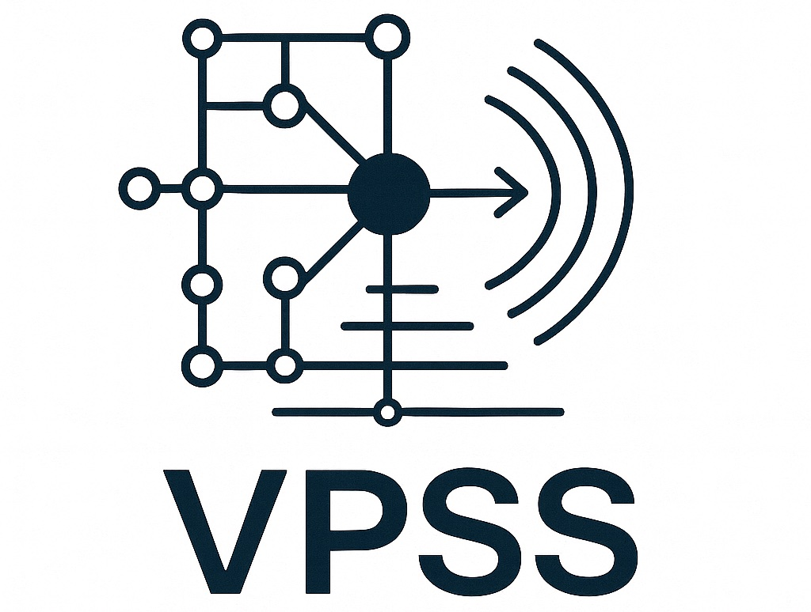

<p align="center">
  
</p>

## Introduction (Under Construction)

Stay tuned :P

## Installation

Please prepare a clean workspace and execute the following commands:

```bash
# within the workspace
git clone https://github.com/brant-ruan/vpss.git
mkdir workdir
```

Then, install the required Python packages:

```bash
# within the workspace
cd vpss
# It is recommended to create a virtual environment first
virtualenv -p /usr/bin/python3 venv
source venv/bin/activate
pip install -r requirements.txt
```

We also need to install Java and Maven for this project. Please ensure that `java` and `mvn` commands are available in your PATH. The version of Java and Maven in our experiments are shown below:

```bash
java -version
# openjdk version "17.0.14" 2025-01-21
# OpenJDK Runtime Environment (build 17.0.14+7-Ubuntu-124.04)
# OpenJDK 64-Bit Server VM (build 17.0.14+7-Ubuntu-124.04, mixed mode, sharing)

mvn -v
# Apache Maven 3.8.7
# Maven home: /usr/share/maven
# Java version: 17.0.14, vendor: Ubuntu, runtime: /usr/lib/jvm/java-17-openjdk-amd64
# Default locale: en_US, platform encoding: UTF-8
# OS name: "linux", version: "6.8.0-56-generic", arch: "amd64", family: "unix"
```

## Workflow

The workflow of VPSS is shown as below:


Please refer to [the paper](https://arxiv.org/pdf/2506.01342) for more details.

### Step 1: Dependency Graph Construction

#### Step 1.1: MCR Index Preparation

For the first time, we need to download the latest [Maven Central Repository (MCR) index](https://repo1.maven.org/maven2/.index/) data:

```bash
# within the workspace
mkdir -p workdir/mcr && cd workdir/mcr
wget https://repo1.maven.org/maven2/.index/nexus-maven-repository-index.gz
java -jar indexer-cli-5.1.1.jar --unpack nexus-maven-repository-index.gz --destination central-lucene-index --type full
```

After that, we will have a `central-lucene-index` folder under `workdir/mcr/`, which contains the MCR index data.

#### Step 1.2: Artifact List Extraction

Now, run the `maven-index-parser` to extract the artifact list from the MCR index:

```bash
# within the workspace
cd vpss/package-analysis/maven-index-parser
# build the project
mvn -Dmaven.compiler.source=17 -Dmaven.compiler.target=17 clean package
# run the parser
mvn exec:java -Dexec.mainClass="com.vpa.App"
```

After that, we will get an `artifact-list.csv` file under `workdir/mcr/` with the following format:

```csv
GroupId,ArtifactId,Version,Timestamp
org.sonatype.nexus.plugins.ldap,nexus-ldap-plugin-it,1.9.2.1,1310694579000
org.ow2.util,util-plan-monitor-api,1.0.16,1239010118000
org.ow2.util,util-geolocation-ear,1.0.28,1299604696000
org.seleniumhq.selenium,selenium-ie-driver,2.4.0,1313612545000
org.ow2.jonas.assemblies,binaries,5.2.0-M4,1297362732000
...
```

Then, convert the CSV file into JSON format for later use:

```bash
# within the workspace
cd vpss/package-analysis
python scripts/gav_csv_to_json.py ../../workdir/mcr/artifacts-list.csv ../../workdir/mcr/artifacts-list.json
```

#### Step 1.3: POM File Downloading

Now, we can download the `pom.xml` files for all artifacts in MCR by running the following command:

```bash
# within the workspace
cd vpss/package-analysis
python scripts/download_poms.py ../../workdir/mcr/artifacts-list.json
```

Note that this step may take a **very very long time** if only one thread is used. Hence, the command above is only for demonstration purposes. In practice, you need to split the `artifacts-list.json` file into multiple smaller files and run multiple instances of `download_poms.py` in parallel to speed up the download process.

#### Step 1.4: POM File Parsing


#### Step 1.5: Dependency Graph Generation

#### Notes on Incremental Updates

### Step 2: Vulnerable Function Identification


### Step 3: Vulnerability Propagation Analysis

To perform vulnerability propagation analysis, run the following command ()

```bash
python ./vpa-analyzer.py --cve CVE-2016-5393 --proc-num-deps 16 --proc-num-cg 16
```

Notes:

- We used Soot to perform static analysis and build the call graphs for experiments in this paper. Although we also tested with Tai-e, it is an experimental option and may require more effort to work properly.

### Step 4: VPSS Calculation


## Citation

If you use VPSS, please cite the [following paper](https://arxiv.org/pdf/2506.01342):

```
@inproceedings{ruan2025vpss,
  title={Propagation-Based Vulnerability Impact Assessment for Software Supply Chains},
  author={Ruan, Bonan and Lin, Zhiwei and Liu, Jiahao and Zhang, Chuqi and Ji, Kaihang and Liang, Zhenkai},
  booktitle={Proceedings of the 40th IEEE/ACM International Conference on Automated Software Engineering},
  year={2025}
}
```